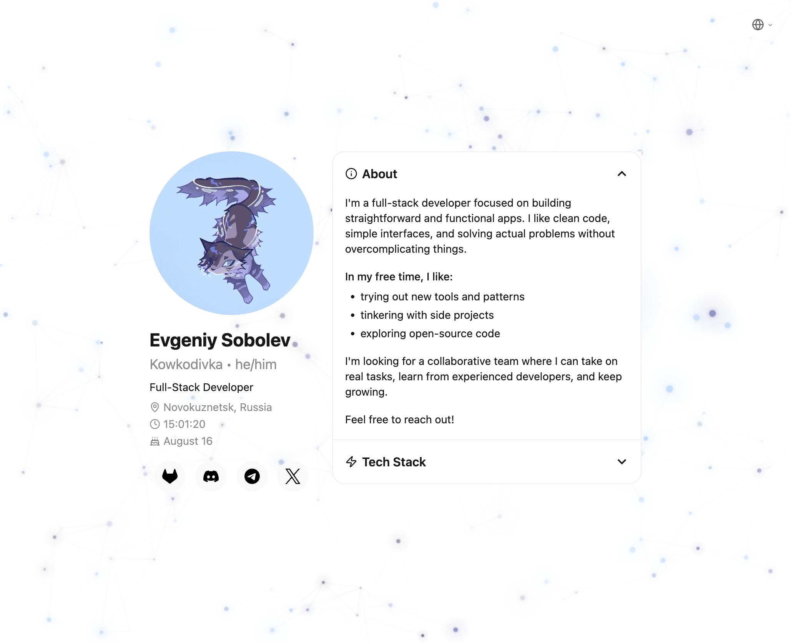

# kowkodivka

My personal website, built with [Vite](https://vite.dev/) and [SolidJS](https://www.solidjs.com/).



## Developing

1. Install dependencies

   ```bash
   bun install
   ```

2. Start the development server

   ```bash
   bun run dev
   ```

## Building

1. Build the site

   ```bash
   bun run build
   ```

2. Preview the built site

   ```bash
   bun run preview
   ```

## License

This project is licensed under the GNU General Public License v3.0. See the [LICENSE.md](./LICENSE.md) file for details.
